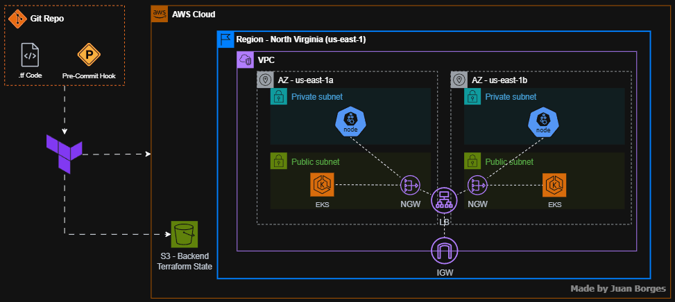

# Terraform AWS EKS

## High-Level Architecture

## Steps
- Networking (VPC, Subnets, Route Tables, IGW (Internet Gateway), NGW (NAT Gateway), Elastic IP)
- Cluster
- Nodes
- eksctl
- OIDC - Open ID Connect
- AWS Load Balancer Controller (to create the Ingresses)
- Helm

## Docs and Resources
- [VPC and subnet requirements](https://docs.aws.amazon.com/eks/latest/userguide/network-reqs.html)  
- [Amazon EKS cluster IAM role](https://docs.aws.amazon.com/eks/latest/userguide/cluster-iam-role.html)  
- [Amazon EKS node IAM role](https://docs.aws.amazon.com/eks/latest/userguide/create-node-role.html)  
- [Create an IAM OIDC provider for your cluster](https://docs.aws.amazon.com/eks/latest/userguide/enable-iam-roles-for-service-accounts.html)  
- [Install AWS Load Balancer Controller with Helm](https://docs.aws.amazon.com/eks/latest/userguide/lbc-helm.html)
- [Pre-Commit Hook Terraform](https://github.com/antonbabenko/pre-commit-terraform)

## Pre-Commit Hook
Current Setup:
- Terraform Validate
- Terraform Fmt -recursive
- Terraform Docs

 
## Documentation Below Using Terraform Docs
<!-- BEGIN_TF_DOCS -->
## Requirements

| Name | Version |
|------|---------|
|  [aws](#requirement\_aws) | 5.82.2 |
|  [helm](#requirement\_helm) | 2.17.0 |
|  [kubernetes](#requirement\_kubernetes) | 2.35.1 |

## Providers

| Name | Version |
|------|---------|
|  [aws](#provider\_aws) | 5.82.2 |

## Modules

| Name | Source | Version |
|------|--------|---------|
|  [eks\_aws\_load\_balancer\_controller](#module\_eks\_aws\_load\_balancer\_controller) | ./modules/aws-load-balancer-controller | n/a |
|  [eks\_cluster](#module\_eks\_cluster) | ./modules/cluster | n/a |
|  [eks\_managed\_node\_group](#module\_eks\_managed\_node\_group) | ./modules/managed-node-group | n/a |
|  [eks\_network](#module\_eks\_network) | ./modules/network | n/a |

## Resources

| Name | Type |
|------|------|
| [aws_s3_bucket.bucket](https://registry.terraform.io/providers/hashicorp/aws/5.82.2/docs/resources/s3_bucket) | resource |
| [aws_s3_bucket_versioning.versioning](https://registry.terraform.io/providers/hashicorp/aws/5.82.2/docs/resources/s3_bucket_versioning) | resource |

## Inputs

| Name | Description | Type | Default | Required |
|------|-------------|------|---------|:--------:|
|  [cidr\_block](#input\_cidr\_block) | Network CIDR Block for VPC | `string` | n/a | yes |
|  [project\_name](#input\_project\_name) | Project Name to be used to name Resources, as a tag | `string` | n/a | yes |
|  [region](#input\_region) | AWS Region to create Resources | `string` | n/a | yes |
|  [tags](#input\_tags) | A map of tags to add to all AWS Resources | `map(any)` | n/a | yes |

## Outputs

| Name | Description |
|------|-------------|
|  [ca](#output\_ca) | n/a |
|  [eks\_vpc\_config](#output\_eks\_vpc\_config) | n/a |
|  [endpoint](#output\_endpoint) | n/a |
|  [oidc](#output\_oidc) | n/a |
|  [oidc\_id](#output\_oidc\_id) | n/a |
<!-- END_TF_DOCS -->